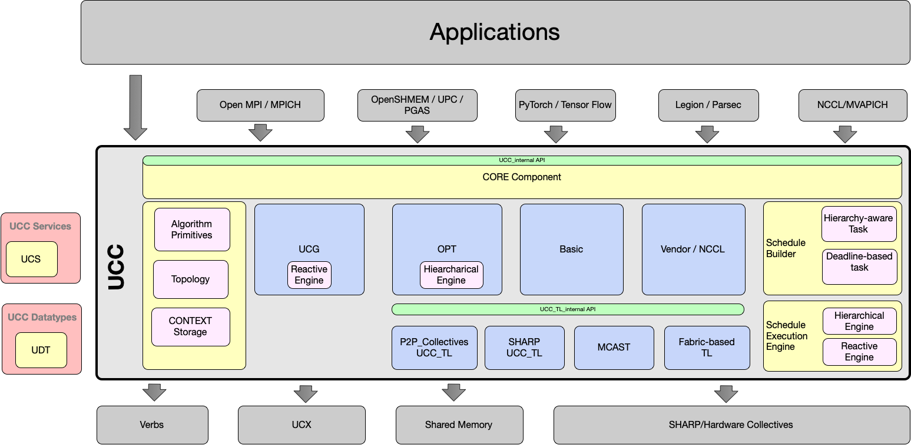

# CI tester
# Unified Collective Communication (UCC)


UCC is a collective communication operations API and library that is flexible, complete, and feature-rich for current and emerging programming models and runtimes.

- [Design Goals](#design-goals)
- [API](https://openucx.github.io/ucc/)
- [Building](#compiling-and-installing)
- [Community](#community)
- [Contributing](#contributing)
- [License](#license)
- [Publication](#publication)

## Design Goals
* Highly scalable and performant collectives for HPC, AI/ML and I/O workloads
* Nonblocking collective operations that cover a variety of programming models
* Flexible resource allocation model
* Support for relaxed ordering model
* Flexible synchronous model
* Repetitive collective operations (init once and invoke multiple times)
* Hardware collectives are a first-class citizen

### UCC Component Architecture


## Contributing
Thanks for your interest in contributing to UCC, please see our technical and
legal guidelines in the [contributing](CONTRIBUTING.md) file.

All contributors have to comply with ["Membership Voluntary
Consensus Standard"](https://ucfconsortium.org/policy/)  and ["Export Compliant
Contribution Submissions"](https://ucfconsortium.org/policy/) policies.

## License
UCC is BSD-style licensed, as found in the [LICENSE](LICENSE) file.

## Required packages

* [UCX](https://github.com/openucx/ucx)
   * UCC uses utilities provided by UCX's UCS component

* [CUDA](https://developer.nvidia.com/cuda-toolkit) (optional)
   * UCC supports CUDA collectives. To compile with CUDA support, install
     [NVIDIA CUDA](https://developer.nvidia.com/cuda-downloads) 11.0 or above.

* [HIP](https://rocmdocs.amd.com/en/latest/Programming_Guides/HIP-GUIDE.html) (optional)
   * UCC supports AMD GPUs using HIP. Instructions for installing ROCM/HIP can be found at
     [AMD ROCM](https://rocmdocs.amd.com/en/latest/Installation_Guide/Installation_new.html).

* Doxygen
   * UCC uses Doxygen for generating API documentation

## Compiling and Installing

### Developer's Build
```sh
$ ./autogen.sh
$ ./configure --prefix=<ucc-install-path> --with-ucx=<ucx-install-path>
$ make
```

### Build Documentation
```sh
$ ./autogen.sh
$ ./configure --prefix=<ucc-install-path> --with-docs-only
$ make docs
```

### Open MPI and UCC collectives

#### Compile UCX 
```sh
$ git clone https://github.com/openucx/ucx
$ cd ucx
$ ./autogen.sh; ./configure --prefix=<ucx-install-path>; make -j install
```
#### Compile UCC

```sh
$ git clone https://github.com/openucx/ucc
$ cd ucc
$ ./autogen.sh; ./configure --prefix=<ucc-install-path> --with-ucx=<ucx-install-path>; make -j install
```

#### Compile Open MPI 

```sh
$ git clone https://github.com/open-mpi/ompi
$ cd ompi
$ ./autogen.pl; ./configure --prefix=<ompi-install-path> --with-ucx=<ucx-install-path> --with-ucc=<ucc-install-path>; make -j install
```

#### Run MPI programs

```sh
$ mpirun -np 2 --mca coll_ucc_enable 1 --mca coll_ucc_priority 100 ./my_mpi_app
```

#### Run OpenSHMEM programs

```sh
$ mpirun -np 2 --mca scoll_ucc_enable 1 --mca scoll_ucc_priority 100 ./my_openshmem_app
```


### SUPPORTED Transports
* UCX/UCP
  - InfiniBand, ROCE, Cray Gemini and Aries, Shared Memory
* SHARP
* CUDA
* NCCL
* RCCL
* MLX5


### Publication

To cite UCC in a publication, please use the following BibTex entry:

```
@inproceedings{DBLP:conf/hoti/VenkataPLBALBDS24,
  author       = {Manjunath Gorentla Venkata and
                  Valentine Petrov and
                  Sergey Lebedev and
                  Devendar Bureddy and
                  Ferrol Aderholdt and
                  Joshua Ladd and
                  Gil Bloch and
                  Mike Dubman and
                  Gilad Shainer},
  title        = {Unified Collective Communication {(UCC):} An Unified Library for CPU,
                  GPU, and {DPU} Collectives},
  booktitle    = {{IEEE} Symposium on High-Performance Interconnects, {HOTI} 2024, Albuquerque,
                  NM, USA, August 21-23, 2024},
  pages        = {37--46},
  publisher    = {{IEEE}},
  year         = {2024},
  url          = {https://doi.org/10.1109/HOTI63208.2024.00018},
  doi          = {10.1109/HOTI63208.2024.00018},
  timestamp    = {Thu, 19 Sep 2024 11:00:54 +0200},
  biburl       = {https://dblp.org/rec/conf/hoti/VenkataPLBALBDS24.bib},
  bibsource    = {dblp computer science bibliography, https://dblp.org}
}
```
